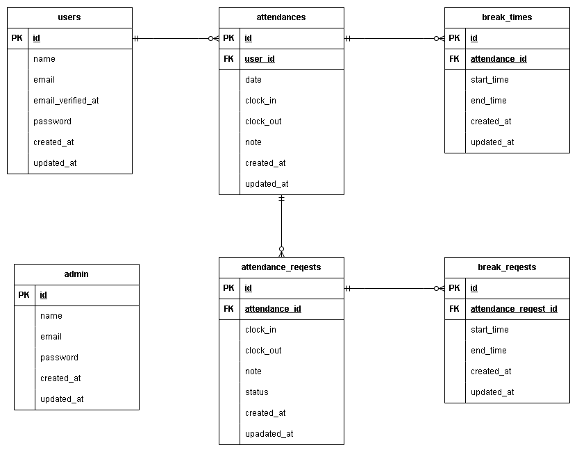

# 模擬案件_勤怠管理アプリ

---

## 環境構築

### Dockerビルド

1. git clone git@github.com:hiroshi-tak/mogi2-form.git
2. docker-compose up -d --build

### Laravel環境構築

1. docker-compose exec php bash
2. composer install
3. cp .env.example .env
   * DB_HOST=mysql
   * DB_DATABASE=laravel_db
   * DB_USERNAME=laravel_user
   * DB_PASSWORD=laravel_pass
   * MAIL_FROM_ADDRESS=test@example.com
4. php artisan key:generate
5. php artisan migrate
6. php artisan db:seed
7. cp .env .env.testing
   * APP_ENV=testing
   * APP_KEY=
   * DB_DATABASE=demo_test
   * DB_USERNAME=root
   * DB_PASSWORD=root
   * MAIL_MAILER=log
   * MAIL_FROM_ADDRESS=test@example.com
   * MAIL_FROM_NAME="Test"
8. mysql -u root -p
9. CREATE DATABASE demo_test;
10. php artisan key:generate --env=testing
11. php artisan config:clear
12. php artisan migrate --env=testing
13. mkdir -p tests/Unit

### 管理者・一般ユーザー登録について
管理者は一人登録
* 管理者
  * ユーザー名	：管理者
  * email		: admin@example.com
  * password		: 12345678

一般ユーザーは3人登録
* 一人目
  * ユーザー名	：user1
  * email		: user1@example.com
  * password		: 12345678
* 二人目
  * ユーザー名	：user2
  * email		: user2@example.com
  * password	    : 12345678
* 三人目
  * ユーザー名	：user3
  * email		: user3@example.com
  * password	    : 12345678

## テスト実行
1. php artisan config:clear
2. php artisan cache:clear
3. php artisan test

## 開発環境

- 管理者ログイン画面:http://localhost/admin/login
- 管理者勤怠一覧画面:http://localhost/admin/attendance/list
- 一般ユーザー会員登録画面:http://localhost/register
- 一般ユーザーログイン画面:http://localhost/login
- 一般ユーザー勤怠登録画面:http://localhost/attendance
- phpMyAdmin:http://localhost:8080/
- MailHog:http://localhost:8025/

## 使用技術

- PHP 8.1.34
- Laravel 8.83.8
- MySQL 8.0.26
- nginx 1.21.1

## 要件未記載対応
* 表示
  * 勤怠一覧の詳細ボタンは本日以降未表示とした。
  * 管理者で勤怠詳細修正時、"更新しました"と表示するようにした。
  * 管理者の勤怠一覧表示において、カレンダーアイコンをクリックすると日付ピッカーを表示するようにした。
* バリデーション
  * 休憩時間の重複を追加した。

## ER図

